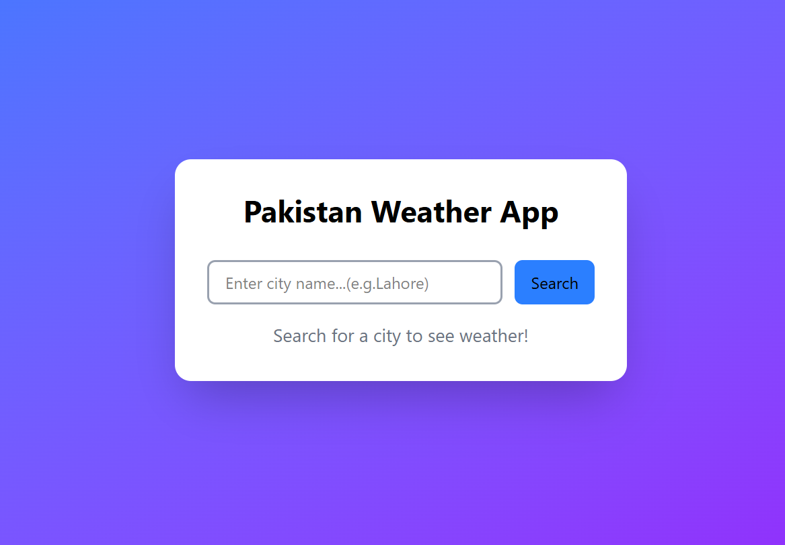
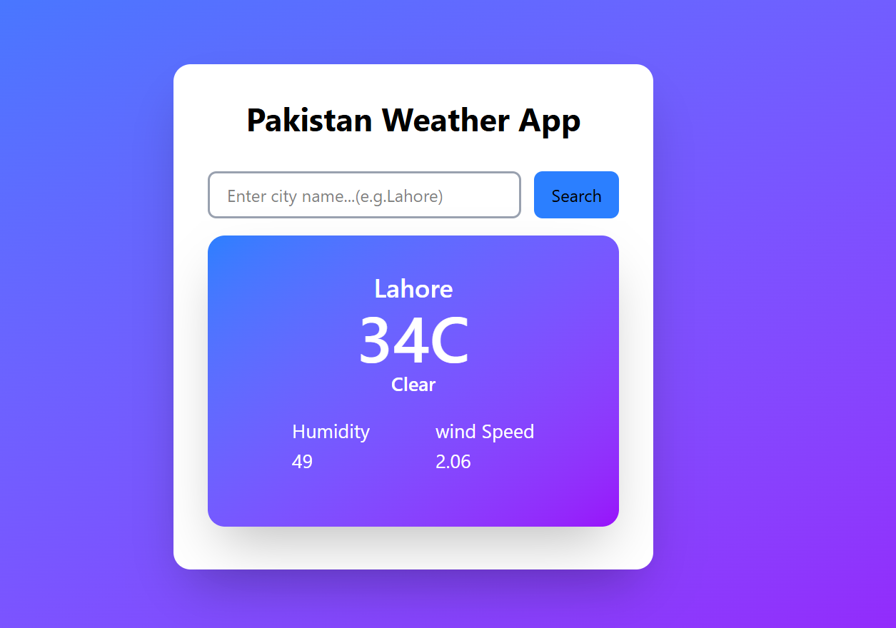

# Pakistan Weather App

A simple weather app to search and view live weather details for Pakistani cities.

## Features

- Search weather by city name (Pakistan only)
- View real-time weather details:
  - Temperature
  - Condition
  - Humidity
  - Wind Speed
- Input validation and error handling

## Tech Stack

- **Frontend:** React + Tailwind CSS (Vite)
- **Backend:** Node.js + Express
- **API:** OpenWeatherMap

## Screenshots

### Search Interface


### Weather Result Display


## API Endpoints

| Method | Endpoint | Description |
|--------|----------|--------------|
| GET | `/health` | Check if server is running |
| POST | `/api/weather` | Get weather data for a city |

## Installation & Setup

### 1. Clone the repository

git clone <your-repo-url>
cd weather-app
```

### 2. Backend Setup
cd weather-app-backend
npm install
```

Create a `.env` file in `weather-app-backend/` folder:

OPENWEATHERMAP_API_KEY=your_api_key_here
PORT=5000


Run backend:
node index.js
```

### 3. Frontend Setup (New Terminal)
cd weather-app-frontend
npm install
npm run dev
```

### 4. Open in Browser
Visit `http://localhost:5173` and search for a city.

## What I Learned

- Building a full-stack app with separate frontend/backend architecture
- Working with external APIs and environment variables for security
- Input validation and error handling on both client and server side
- React state management with `useState` and conditional rendering